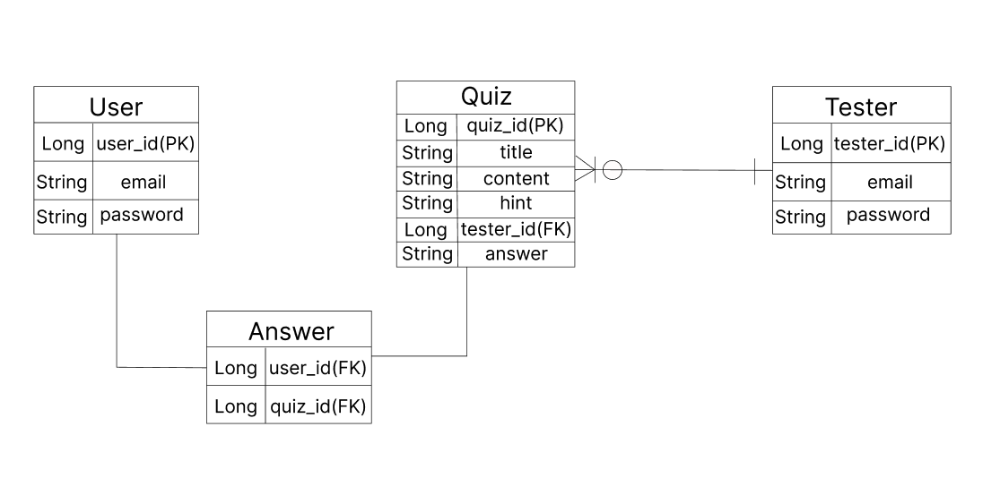

# Quiz Project
## stack: SpringBoot, Mysql
## goal: MSA 기반으로 출제자와 응답자로 나누어 퀴즈를 만들고 푸는 프로그램

### 요구사항:
    1. 회원은 문제 출제자와 답변자 두 개의 역할로 나뉜다
        1. 문제 출제자는 문제를 만들 수 있으나, 문제를 풀 수는 없다.
        2. 문제 답변자는 문제를 풀 수는 있으나, 만들 수는 없다.
    2. 문제 출제자
        1. 문제와 답과 힌트를 만든다.
        2. 문제 리스트를 볼 수 있다.
        3. 문제를 수정 할 수 있다.
        4. 문제를 삭제 할 수 있다.
    3. 답변자
        1. 문제 리스트를 볼 수 있다.
            1. 정답을 맞춘 문제와 맞추지 못한 문제의 목록은 나누어져 있다.
        2. 문제를 볼 수 있다.
            1. 정답을 맞춘 문제는 중복되어 나올 수 없다.
            2. 힌트를 볼 수 있다.
        3. 답을 체크 할 수 있다.

### ERD
